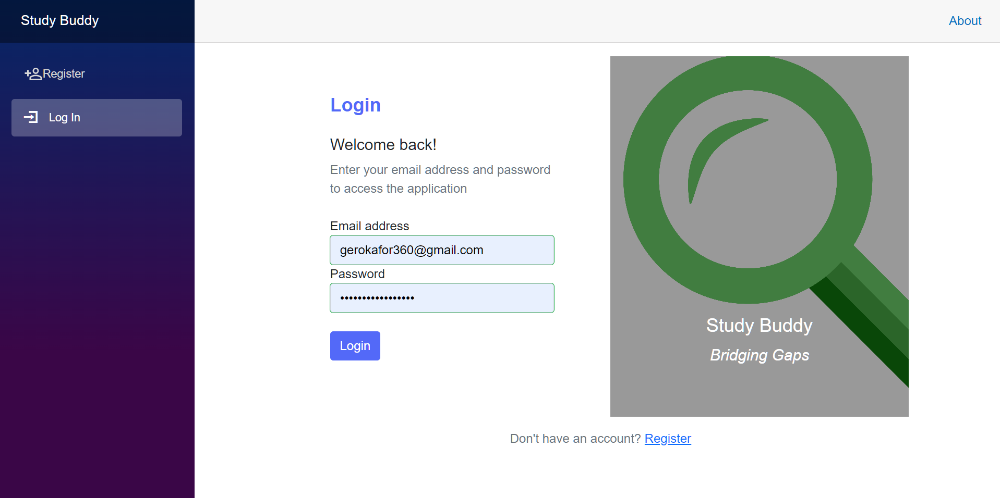

# StudyBuddy

## Overview

StudyBuddy is a .NET-based application that was built to help students find compatible study partners within their university. It leverages Blazor WebAssembly for the client-side, ASP.NET Web API for the server-side, and MSSQL Server for the database.
## Table of Contents

- [Installation](#Installation)
- [Usage](#usage)
- [Features](#features)
- [Examples](#examples)
- [Contributing](#contributing)

## Installation

To get started with the StudyBuddy, follow these steps:

```bash
# Clone the repository
git clone https://github.com/OkaforGerald/StudyBuddy.git

# Navigate to the project directory
cd StudyBuddy

# Install dependencies
dotnet restore
```
## Usage

After installing the dependencies, you can build and run the project:

```bash
# Build the project
dotnet build

# Run the project
dotnet run
```

## Features
- User authentication and authorization.
- Profile creation with social media links and proficiency in courses.
- Robust search functionality.
- Matching algorithm to find compatible study partners.
- Real-time notifications and messaging.

## Examples


## Contributing

Contributions are welcome! If you have any suggestions, bug reports, or feature requests, please open an issue or submit a pull request.
